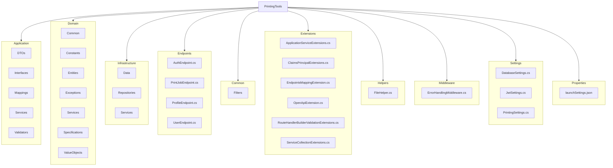

```mermaid
flowchart TD
    A[PrintingTools]
    subgraph Application
        A1[DTOs]
        A2[Interfaces]
        A3[Mappings]
        A4[Services]
        A5[Validators]
    end
    subgraph Domain
        D1[Common]
        D2[Constants]
        D3[Entities]
        D4[Exceptions]
        D5[Services]
        D6[Specifications]
        D7[ValueObjects]
    end
    subgraph Infrastructure
        I1[Data]
        I2[Repositories]
        I3[Services]
    end
    subgraph Endpoints
        E1[AuthEndpoint.cs]
        E2[PrintJobEndpoint.cs]
        E3[ProfileEndpoint.cs]
        E4[UserEndpoint.cs]
    end
    subgraph Common
        C1[Filters]
    end
    subgraph Extensions
        X1[ApplicationServiceExtensions.cs]
        X2[ClaimsPrincipalExtensions.cs]
        X3[EndpointsMappingExtension.cs]
        X4[OpenApiExtension.cs]
        X5[RouteHandlerBuilderValidationExtensions.cs]
        X6[ServiceCollectionExtensions.cs]
    end
    subgraph Helpers
        H1[FileHelper.cs]
    end
    subgraph Middleware
        M1[ErrorHandlingMiddleware.cs]
    end
    subgraph Settings
        S1[DatabaseSettings.cs]
        S2[JwtSettings.cs]
        S3[PrintingSettings.cs]
    end
    subgraph Properties
        P1[launchSettings.json]
    end

    A --> Application
    A --> Domain
    A --> Infrastructure
    A --> Endpoints
    A --> Common
    A --> Extensions
    A --> Helpers
    A --> Middleware
    A --> Settings
    A --> Properties
```
